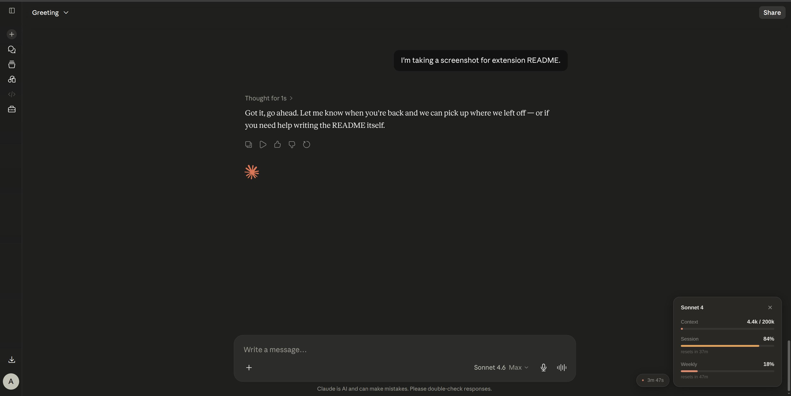
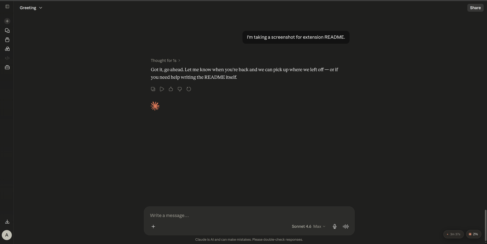

# TokenVeil

A Claude.ai browser extension that blends natively into the UI. Small, calm, and stays out of your way — a single pill in the corner that expands when you need it.

  

## Preview

**Expanded panel** — full stats with bars for context, session (5h), and weekly (7d) usage. A separate cache pill appears above when the conversation cache is active.



**Collapsed pill** — when you don't need the details, just a glanceable percentage with a colored dot indicating warning level.



## What it shows

When collapsed → a small pill in the bottom-right with your context usage %.

When expanded → 
- **Context** — tokens used out of the 200k window, with a bar
- **Session** — your 5-hour usage percentage, with reset countdown
- **Weekly** — your 7-day usage percentage, with reset countdown
- **Model** — which Claude model is currently active

When the conversation cache is active → a separate **Cache pill** floats above the main pill, counting down the time remaining. It disappears once expired.

The pill dot turns yellow above 70% and red above 90% — you'll know without even expanding.

## Why "veil"?

It's there, but you don't feel it. Matches Claude's cream/coral palette in both light and dark mode. Looks like it ships with the site.

## Install

### Easy install (Chrome / Edge)

1. Download [`tokenveil-1.0.1.zip`](https://github.com/CRAzyAbd/tokenveil/releases/latest/download/tokenveil-1.0.1.zip)
2. Open `chrome://extensions` and enable **Developer mode** (top-right)
3. Drag the ZIP onto the page

### From source

1. Clone this repo
```bash
   git clone https://github.com/CRAzyAbd/tokenveil.git
```
2. Open `chrome://extensions` → enable **Developer mode**
3. Click **Load unpacked** and select the `tokenveil` folder
4. Open claude.ai — pill appears in the bottom-right

## Project Structure

<pre>
tokenveil/
├── icons/                        # Cream + coral extension icons
├── screenshots/                  # README screenshots
├── src/
│   ├── modules/
│   │   ├── tokenCounter.js       # Token estimation
│   │   ├── usageTracker.js       # Claude /usage API
│   │   ├── modelDetector.js      # Active model detection
│   │   └── cacheTimer.js         # Cache window countdown
│   ├── content.js                # Main injection script
│   ├── background.js             # Service worker
│   └── styles.css                # Native-feel styling
├── popup/                        # Extension popup
└── manifest.json
</pre>

## Privacy

All data stays local. The extension only talks to claude.ai. No external servers, no tracking, no analytics.

## License

MIT

